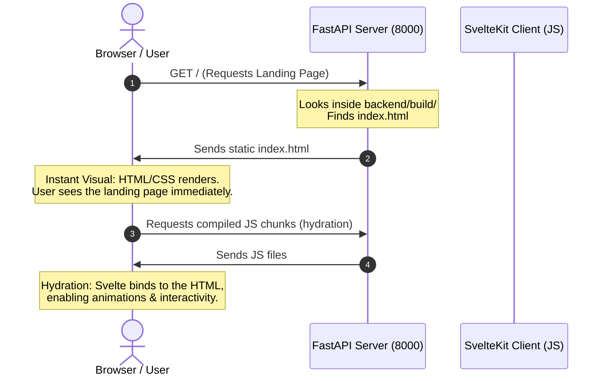

# How SvelteKit Fetches and Renders the Landing Page

Because your project is configured with **`@sveltejs/adapter-static`** (in `vite.config.js`), it behaves as a **Prerendered SPA (Single Page Application)**. Here is the step-by-step lifecycle of how your landing page is fetched, loaded, and run.

---

## The Request and Render Lifecycle



---

### Step 1: Pre-rendering (Build Time)
When you run `npm run build`:
1. SvelteKit compiles the Svelte templates (`+layout.svelte`, `+page.svelte`) and styles (`landing.css`).
2. It generates a static HTML file at `backend/build/index.html`.
3. In this file, SvelteKit injects pre-rendered HTML structure along with script tags linking to the compiled JavaScript bundles (stored in `_app/immutable/`).

---

### Step 2: The Initial Fetch (FastAPI Response)
When a user opens `http://localhost:8000/`:
1. The browser sends a `GET /` request.
2. The FastAPI server's catch-all route handles this:
   ```python
   # Inside app.py
   return FileResponse(os.path.join(frontend_dir, "index.html"))
   ```
3. FastAPI responds by returning `index.html`. The browser immediately renders this HTML and applies the styles.
4. **Benefit**: The user sees the page instantly, and search engine crawlers (SEO) read the full content without waiting for Javascript execution.

---

### Step 3: Client-Side Hydration
Immediately after rendering the initial HTML, the browser downloads the linked Javascript bundles:
1. SvelteKit’s entry script (`start.[hash].js`) initializes.
2. It performs **Hydration**: Svelte reconstructs the component tree in memory, maps it to the existing DOM structure, and registers active event listeners (like button clicks).
3. The page is now fully interactive.

---

### Step 4: Client-Side Navigation (SPA Mode)
Once hydrated, SvelteKit intercepts all internal anchor link clicks:
1. If the user clicks `<a href="/about">About</a>`, SvelteKit prevents the browser's default behavior of reloading the tab.
2. SvelteKit fetches only the small JS chunk for the `/about` page.
3. SvelteKit updates the browser's address bar to `/about` and swaps out the view instantly.
4. If a route isn't pre-rendered (or if they reload the page on a dynamic route), FastAPI falls back to `index.html`, and SvelteKit's client router reads the URL bar to render the correct page view.
